# Lightweight Linux Managed System Containers

<p align="center">
  <picture>
    <source media="(prefers-color-scheme: dark)"  srcset="mockups/name-banner/name-lattice-dark.svg">
    <source media="(prefers-color-scheme: light)" srcset="mockups/name-banner/name-lattice-light.svg">
    
  </picture>
</p>

**Sandboxed Linux system-container environments for AI agents.**

> Repo & package: **`llm-system-containers`** · CLIs: **`llmsc`** (containers) ·
> **`llmsctl`** (platform).

Give an AI agent its own *lightweight Linux machine* — a real, isolated, observable environment it
can work in like a developer would — with infrastructure-level safety backstops underneath, so
the agent's own (imperfect) permissions are never the only thing protecting your host.

> **"LLM"** = *Lightweight Linux Managed* + *Large Language Model*. The unit is an **LLMSC** — a
> Lightweight Linux Managed System Container.

> ⚠️ **Status: pre-alpha — implementation underway.** Architecture, tech stack, and core
> feasibility are settled (rootless container nesting is [proven](planning/spike-plan.md)).
> **M0–M2 are done** — the Rust workspace + TOML config model, platform bring-up (VM + Incus),
> and sandbox lifecycle. Services, security/enforcement, and the GUI are **in progress**: the
> shared `llmsc-core` library has a real Incus client, declarative reconcile, six service
> deployers, and the first enforcement rings (per-container egress ACLs + per-UID Tetragon
> policies); both CLIs are wired to it; and a Tauri + Svelte desktop GUI (16 screens) is live.
> A few subcommands remain stubs (e.g. `llmsc cp`). All test-first — **114 Rust + 64 GUI
> tests** pass. See [buildout.md](planning/buildout.md). Design docs live in
> [`planning/`](planning/), GUI design explorations in [`mockups/`](mockups/).

## Why this is different

Most agent sandboxes isolate a *process* (no real machine) or hand the agent an app container
(where running Docker needs insecure `--privileged`). This project gives the agent a full
**unprivileged system container** (Incus/LXC), which means:

- **Real, rootless nested containers.** An agent can run `docker build` / `docker compose` /
  local CI **inside** its sandbox — no privileged Docker-in-Docker, no broken isolation.
  ([proven in the spike](planning/spike-plan.md))
- **A whole system, not a snippet runner.** Full init, real Linux users, services — agents
  work like developers.
- **Infrastructure backstops.** Unprivileged containers, per-user (per-UID) isolation, network
  policy, and kernel-level (eBPF) enforcement — defense in depth, not trust.
- **Observable, interruptable, steerable.** Humans can watch agents, interrupt them, and
  redirect them.
- **Credential isolation.** Agents call LLMs through a proxy with **virtual keys** — they never
  hold real API keys.

## Architecture at a glance

"Layer" = a level of virtualization *nesting* (it's containerization, one shared kernel — not
nested virtualization):

```
Host                  your computer (Linux/macOS); llmsc/llmsctl installed here
└─ L1: VM             host-native VM running Incus
   └─ L2: system container   unprivileged LLMSC — the agent/human "sandbox"
        └─ L3: app container  rootless Docker/Podman nested inside (a key differentiator)
```

Services (LLM proxy, observability, storage, git) run either in the VM or their own isolated
container. See [`planning/overview.md`](planning/overview.md).

## Interfaces

- **`llmsc`** — manage individual sandboxes: `launch`, `ls`, `shell user@name`, `cp`, `rm`,
  `apply` (reconcile config → Incus), `egress` (network policy), `agent pause|resume|stop|steer`,
  `mount-shared`.
- **`llmsctl`** — manage the platform: `init`, `up`, `down`, `destroy`, `status`,
  `services {list|status|enable|disable|up}`, `keys {ls|sync|set-provider}`, `tetragon`,
  `doctor` (one-shot health report).
- A **GUI** (Tauri + Svelte) over the same core, with at-a-glance status, a service/sandbox
  wizard, a fleet security-posture view, and agent observe/interrupt/steer.

## Tech stack

Rust core (`llmsc-core` crate) shared by both CLIs and the Tauri GUI; declarative **TOML**
config (`llmsc.toml`); **Incus** as the runtime source of truth (raw `incus` always usable
underneath); **Svelte 5 + TypeScript** frontend. Bootstrapping scripts are `uv` single-file
Python. Built test-first (red-green TDD). See [`planning/tech-stack.md`](planning/tech-stack.md).

## Build & test

```bash
cargo build && cargo test --all      # Rust workspace (core + both CLIs)
cd gui && pnpm install && pnpm test  # GUI (svelte-check via `pnpm check`)
```

See [`CLAUDE.md`](CLAUDE.md) for the full command list and pre-commit/CI gates.

## Project status & roadmap

Pre-alpha; implementation sequenced into milestones (M0 workspace → M1 platform bring-up → M2
sandbox lifecycle → M5 services → M7 security → M8 GUI). M0–M2 done; services, enforcement, and
GUI in progress. See [`planning/buildout.md`](planning/buildout.md) and
[`planning/mvp.md`](planning/mvp.md).

## Repository layout

| Path | What |
|---|---|
| [`crates/`](crates/) | Rust workspace — `llmsc-core` (library), `llmsc` + `llmsctl` (CLIs) |
| [`gui/`](gui/) | Tauri + Svelte desktop app (`src/` frontend, `src-tauri/` Rust shell) |
| [`planning/`](planning/) | Design docs (architecture, security, networking, services, roadmap) |
| [`mockups/`](mockups/) | Static HTML GUI explorations — open `mockups/index.html` |
| [`scripts/`](scripts/) | `uv` bootstrapping scripts (e.g. the feasibility spike) |

## License

Licensed under either of **[Apache License, Version 2.0](LICENSE-APACHE)** or
**[MIT license](LICENSE-MIT)** at your option.

## Contributing

Not yet open for contributions (pre-alpha). When it opens, contributions will be accepted under
a **DCO** (Developer Certificate of Origin) and dual-licensed under MIT OR Apache-2.0 — i.e.,
unless you state otherwise, any contribution you intentionally submit shall be dual-licensed as
above, with no additional terms.
